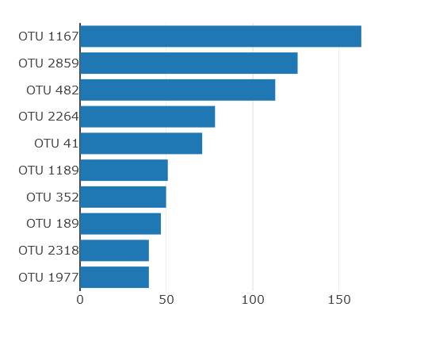
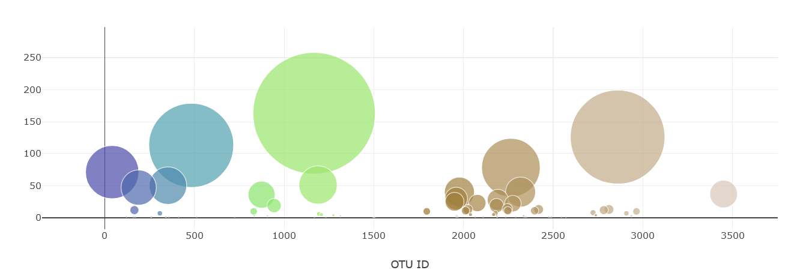
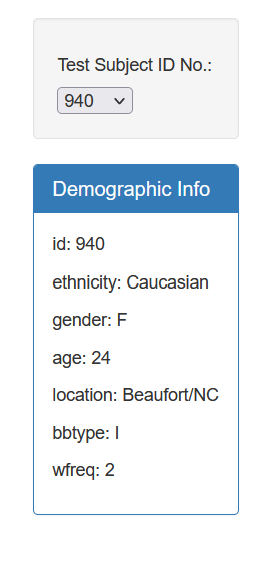
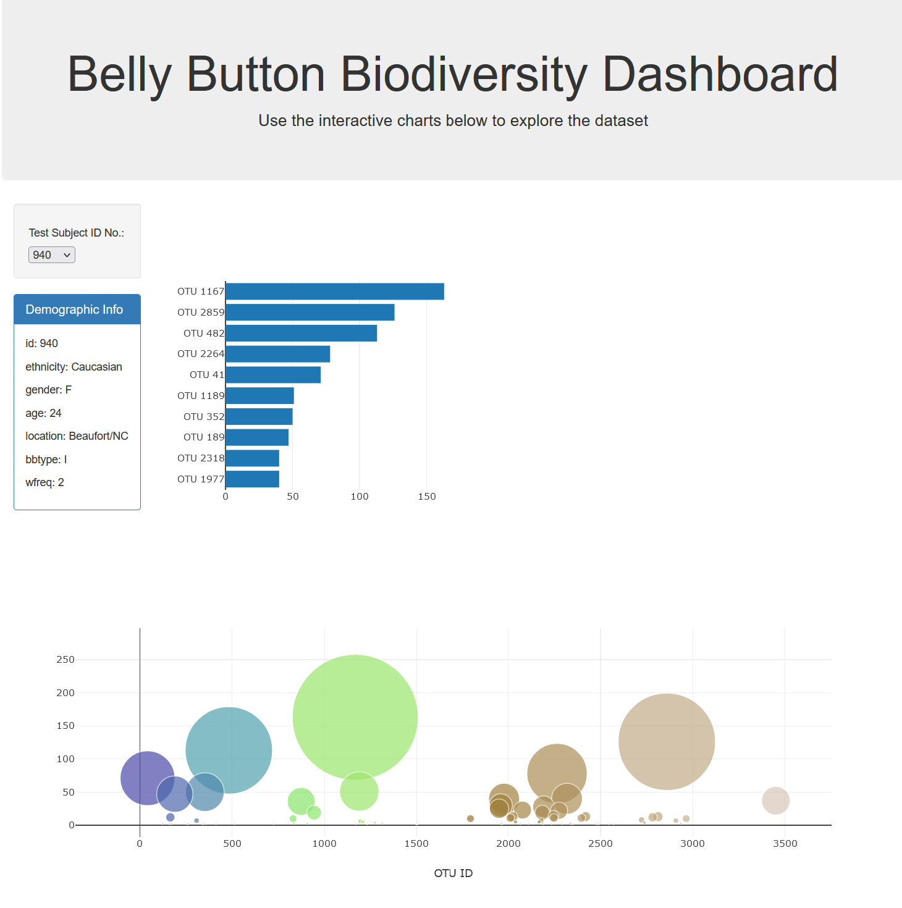

# Module 14 Challenge:  Belly Button Biodiversity

In this assignment, we were tasked with building an interactive dashboard to explore the Belly Button Biodiversity dataset (http://robdunnlab.com/projects/belly-button-biodiversity/), which catalogs the microbes that colonize human navels.

The dataset reveals that a small handful of microbial species (also called operational taxonomic units, or OTUs, in the study) were present in more than 70% of people, while the rest were relatively rare.

## Steps completed:

Use the D3 library to read in `samples.json` from the URL `https://2u-data-curriculum-team.s3.amazonaws.com/dataviz-classroom/v1.1/14-Interactive-Web-Visualizations/02-Homework/samples.json`.

### 2. Create a horizontal bar chart with a dropdown menu to display the top 10 OTUs found in that individual.

  * Use `sample_values` as the values for the bar chart.

  * Use `otu_ids` as the labels for the bar chart.

  * Use `otu_labels` as the hovertext for the chart.

  

### 3. Create a bubble chart that displays each sample.

  * Use `otu_ids` for the x values.

  * Use `sample_values` for the y values.

  * Use `sample_values` for the marker size.

  * Use `otu_ids` for the marker colors.

  * Use `otu_labels` for the text values.

### 4. Display the sample metadata, i.e., an individual's demographic information.

### 5. Display each key-value pair from the metadata JSON object somewhere on the page.

### 6. Update all the plots when a new sample is selected. An example dashboard is shown below:

### 7. Deploy your app to a free static page hosting service, such as GitHub Pages. 

- - -

## References

Hulcr, J. et al. (2012) _A Jungle in There: Bacteria in Belly Buttons are Highly Diverse, but Predictable_. Retrieved from: [http://robdunnlab.com/projects/belly-button-biodiversity/results-and-data/](http://robdunnlab.com/projects/belly-button-biodiversity/results-and-data/)

- - -

© 2022 Trilogy Education Services, a 2U, Inc. brand. All Rights Reserved.
